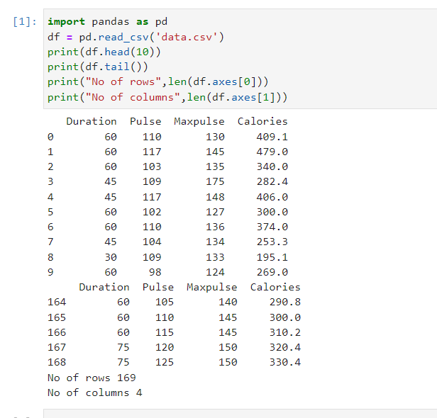

# command-line-arguments-to-count-word
## AIM:
To write a python program for getting the word count from the contents of a file using command line arguments.
## EQUIPEMENT'S REQUIRED: 
PC
Anaconda - Python 3.7
## ALGORITHM: 
### Step 1:
Import pandas.
### Step 2: 
 Import linear_modal from sklearn.
### Step 3: 
Read the file using read_csv.
### Step 4:  
Get the inputs from the user as x and y.
### Step 5: 
Use regr.fit(x,y) to et the output.
### Step 6: 
finish
## PROGRAM:
import pandas as pd
df = pd.read_csv('data.csv')
print(df.head(10))
print(df.tail())
print("No of rows",len(df.axes[0]))
print("No of columns",len(df.axes[1]))
### OUTPUT:

## RESULT:
Thus the program is written to find the word count from the contents of a file using command line arguments.
